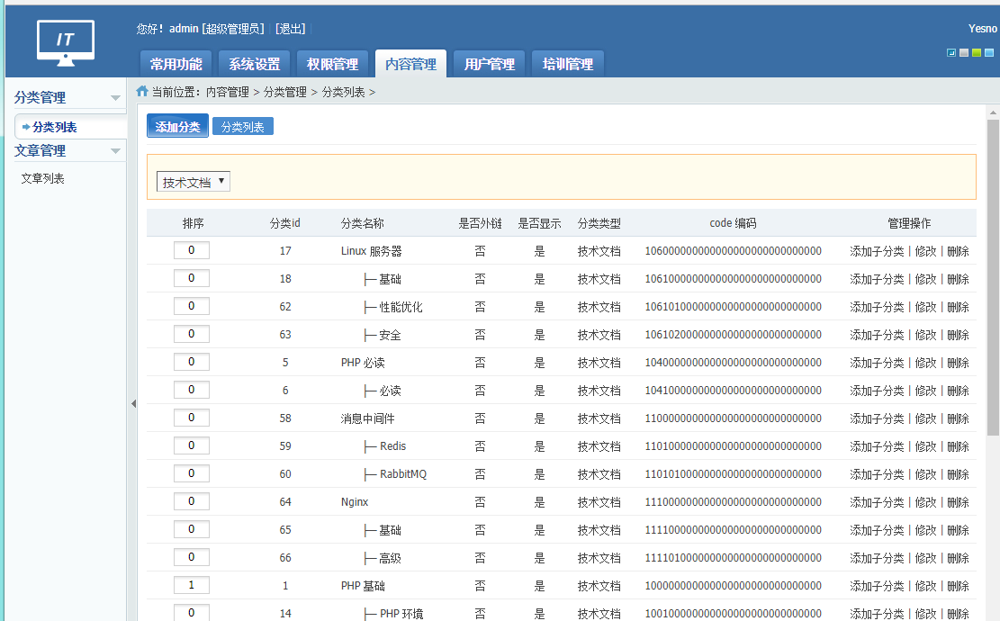
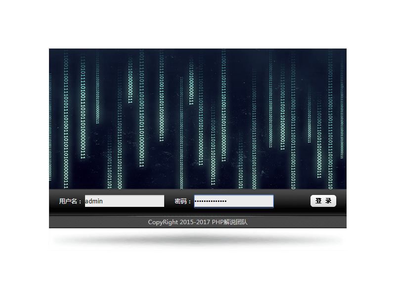
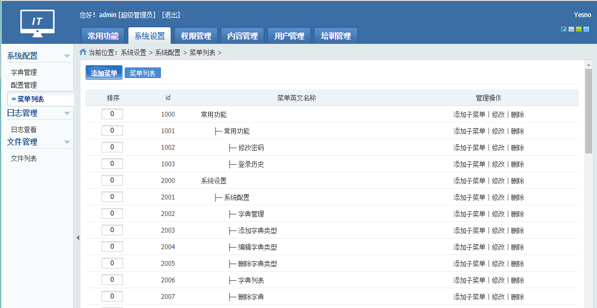
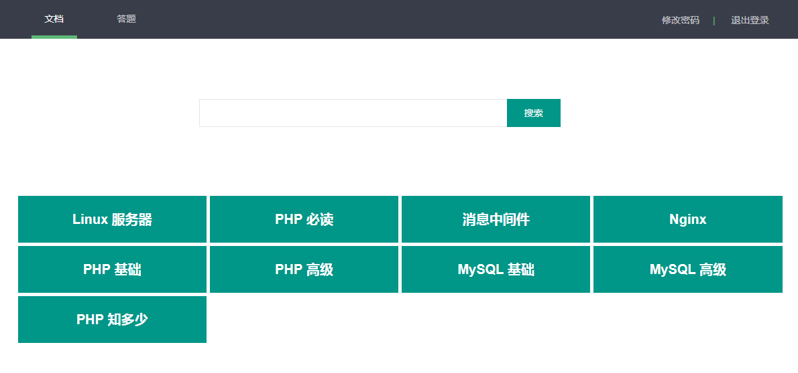
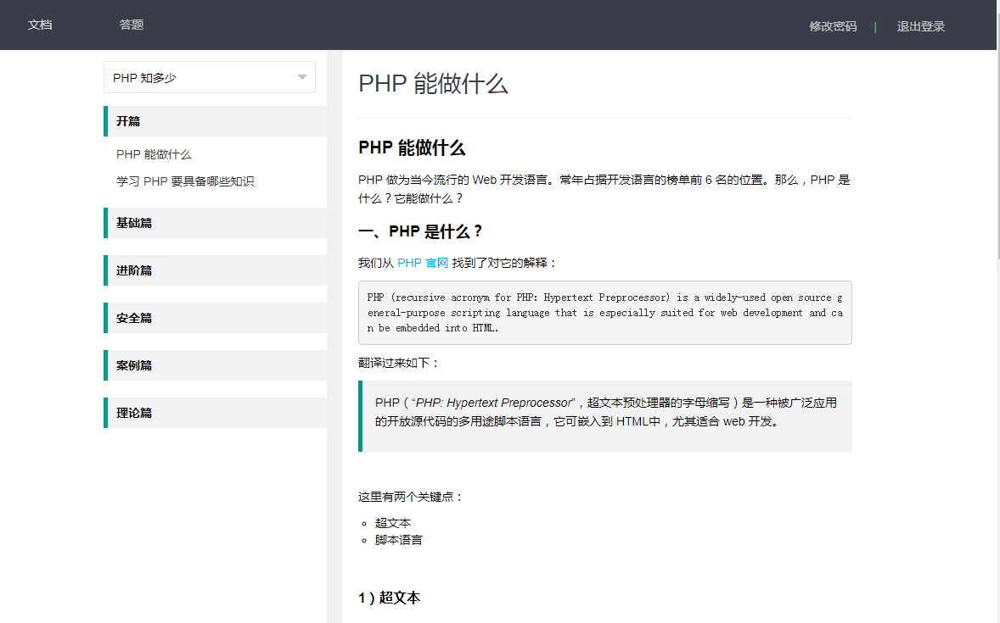
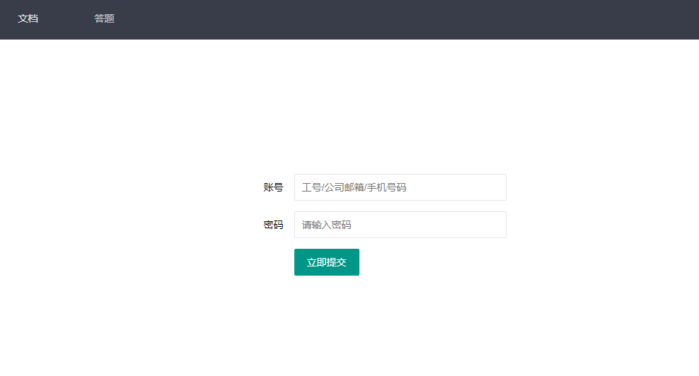
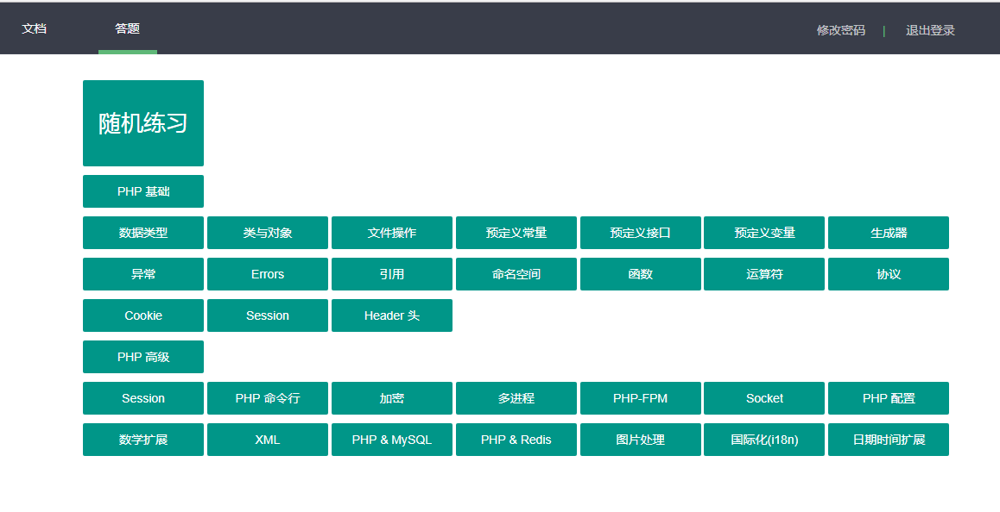
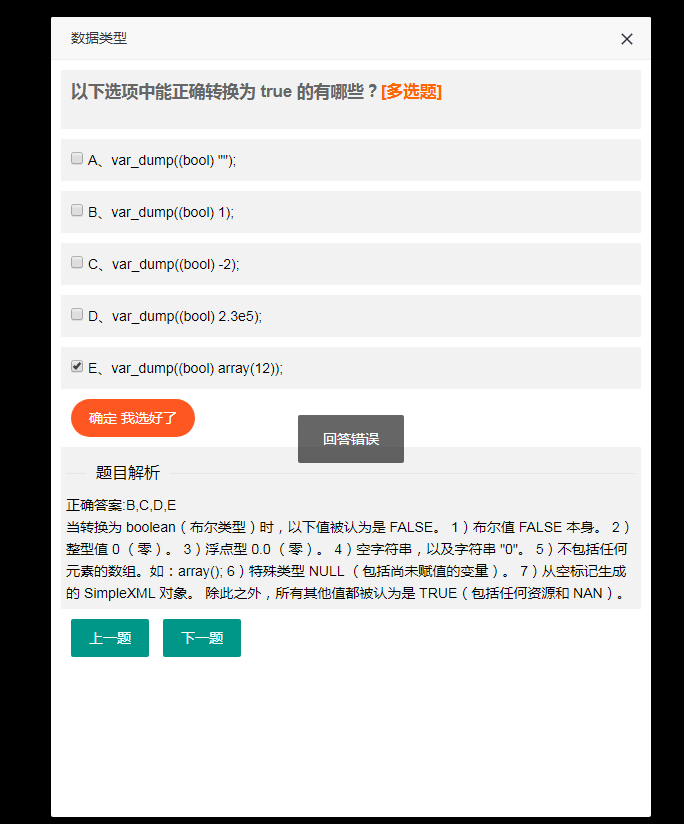
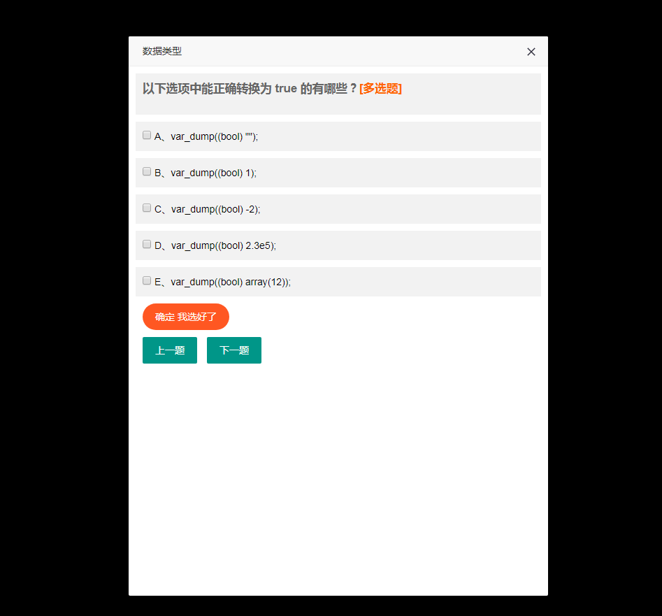

## PHP 解说官网源码

> 该源码是 PHP 解说官网源码。基于 Yaf 框架开发。有完善的管理后台功能。前台功能包含两大主要功能：文档和答题系统。PHP 版本最低需要 PHP 5.6 版本。采用 Redis 做系统缓存。MySQL 做数据存储。管理后台上传的图片采用阿里云 OSS 存储。

官网地址：www.phpjieshuo.com


> 本项目是本人开发用于公司内部培训使用。大家可以基于此项目进一步开发。如果你想一起完善该项目。请联系我。


### 一、部署

#### 1）安装 PHP

请安装 PHP 5.6 + 版本并且已经安装 Yaf 扩展。PHP 5 系统版本与 7 版本系统安装的 Yaf 扩展版本分别对应 Yaf 2.x 和 Yaf 3.x。

#### 2）安装 MySQL

系统的数据库文件位于 docs 目录下面。导入你的数据库当中。然后把配置文件更新到 config/config.ini 里面即可。

#### 3）安装 Redis

安装 Redis，并把配置更新到 config/config.ini 文件。

#### 4）开通阿里云 OSS

阿里云 OSS 用来存储上传的图片。请记住一定要设置为公共读。不然，用自己的域名访问图片会无法读取。


### 二、Nginx 虚拟机配置

```
server {
  listen 80;
  server_name www.phpjieshuo.com;
  access_log /data/wwwlogs/www.phpjieshuo.com_nginx.log combined;
  index index.html index.htm index.php;
  include /usr/local/nginx/conf/rewrite/yaf.conf;
  root /data/wwwroot/www.phpjieshuo.com/public;
  
  #error_page 404 = /404.html;
  #error_page 502 = /502.html;
  
  location ~ [^/]\.php(/|$) {
    #fastcgi_pass remote_php_ip:9000;
    fastcgi_pass unix:/dev/shm/php-cgi.sock;
    fastcgi_index index.php;
    include fastcgi.conf;
  }
  location ~ .*\.(gif|jpg|jpeg|png|bmp|swf|flv|mp4|ico)$ {
    expires 30d;
    access_log off;
  }
  location ~ .*\.(js|css)?$ {
    expires 7d;
    access_log off;
  }
  location ~ /\.ht {
    deny all;
  }
}
```


上面当中用到了重写：`/usr/local/nginx/conf/rewrite/yaf.conf`

```
location / {
    try_files $uri $uri/ /index.php?$query_string;
}
```


### 三、项目目录介绍

```
.
├── apps						应用目录
│   ├── controllers				 前台 Controller 目录
│   ├── modules					 其他模块目录
│   │   ├── Backend				 管理后台模块目录
│   │   │   ├── controllers		  管理后台 Controller 目录
│   │   │   └── views		      管理后台模板目录
│   │   └── Cli					 Yaf Cli 模块目录。
│   └── views				     前台模块目录。
├── config						配置文件目录。
├── docs						文档及数据库目录。
├── library						 项目系统类库目录。
│   ├── common					 公共 Controlle/工具等目录。
│   │   ├── controllers			  公共 Controller
│   │   └── plugins				 插件目录。
│   ├── finger					 自己整理编写的类库。
│   │   ├── Alisdk				 阿里云相关 SDK。
│   │   │   └── Oss				 阿里云 OSS SDK。
│   │   ├── cache				 系统缓存底层包装目录。
│   │   ├── Image				 系统图片处理库。
│   │   ├── session				 Session 包装。
│   │   ├── Thread				 多线程工具（进程包装实现）
│   │   ├── Upload				 上传类库。采用 ThinkPHP 改写。
│   │   └── Verify				 验证码。采用 ThinkPHP 改写。
│   ├── models					 系统 Model 目录。支持多库。
│   ├── PHPExcel				 PHPExcel SDK。Excel 导入导出已经封装到 common 当前的 YOffice.
│   ├── services				系统业务层。该项目采用四层架构。控制层直接调用业务层。
│   └── threads					多线程的调用在写在这里即可。这里面有示例。
├── logs						项目所有的日志都在这里了。
└── public						公共目录。入口文件都在这目录。
    ├── statics					静态资源目录。
    └── upload					上传图片保存的目录。如果采用了 OSS，此目录只临时用。
```


### 四、验证器

在日常开发中，对数据的验证是必不可少的部分。验证器类定义在 `finger\Validator` 中。

#### 1）验证器种类

- 手机号验证器(mobilephone)。
- 座机验证器(telephone)。
- IP地址验证器(ip)。
- 邮编验证器(zipcode)。
- 身份证验证器(idcard)。
- 邮箱验证器(email)。
- URL 验证器(url)。
- MAC 物理地址验证器(mac)。
- 银行卡号验证器(bankcard)。
- QQ 号验证器(qq)。
- 中文验证器(chinese)。
- 字母验证器(alpha)。
- 数字验证器(number)。
- 整型验证器(integer)。
- 浮点型验证器(float)。
- 布尔值验证器(boolean)。
- UTF8字符验证器(utf8)。
- 日期验证器(date)。
- 字母数字下线线破折号验证器(alpha_dash)。
- 字母范围验证器(alpha_between)。
- 数字范围验证器(number_between)。
- 字符串长度验证器(len)。
- 字符串必传验证器(require)。
- 字母或数字验证器(alpha_number)。
- 日期时间比较验证码(date_compare)。

#### 2） 验证器使用

```php
$data = [
    'username' => 'fingerQin',
    'password' => '123456',
    'email'    => '',
    'birthday' => '1988-08-08'
];

$rules = [
    'username' => '用户名|require|len:6:20:0|alpha',
    'password' => '密码|require|alpha_dash|len:6:20:0',
    'email'    => '邮箱|email',
    'birthday' => '生日|date:0'
];

\finger\Validator::valido($data, $rules);
```

`valido` 方法验证不通过会直接抛出异常。通过我们向表插入数据或业务方法接收参数的时候可以用此来进行参数验证。避免穿透到真正执行业务时报错。避免不必要的性能消耗以及破坏用户的体验。

#### 3） 单独使用验证器

有时候，我们可能仅仅只想验证单个值。不希望用那么复杂验证器。则可心单独拆开使用。如下所示：

```
// [1] 验证 URL
$url = "https://www.phpjieshuo.com"
if (!\finger\Validator::is_url($url)) {
    // URL 格式不正确
}

// [2] 验证数值范围
$number = 20;
if (!\finger\Validator::is_number_between($number, $start = 0, $end = 100)) {
    // 值不在 0 ~ 100 之间。
}
```


### 五、访问

前端需要账号登录才可以。所以，可以先登录管理后台添加用户。管理后台账号密码：admin => 123456。

假如你的域名是：www.phpjieshuo.com。

那么管理后台访问地址为：http://www.phpjieshuo.com/Backend/Public/login

前台访问地址为：http://www.phpjieshuo.com。


### 六、相关截图




















最后的最后，祝你使用愉快~

